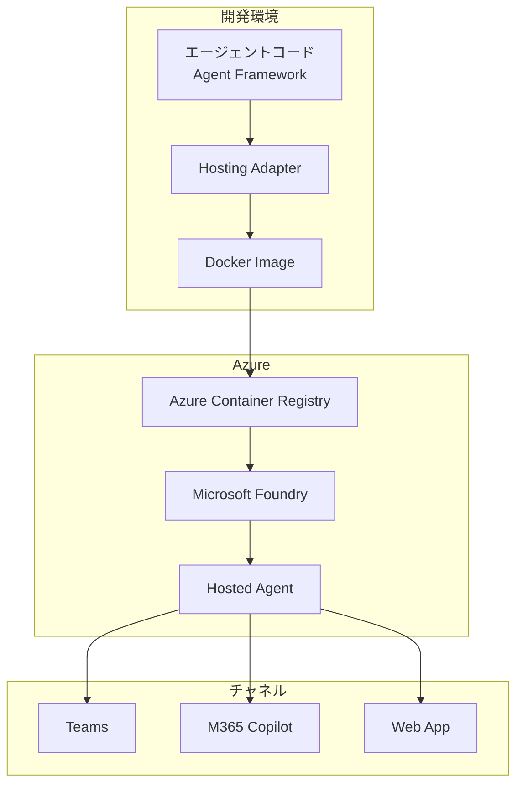
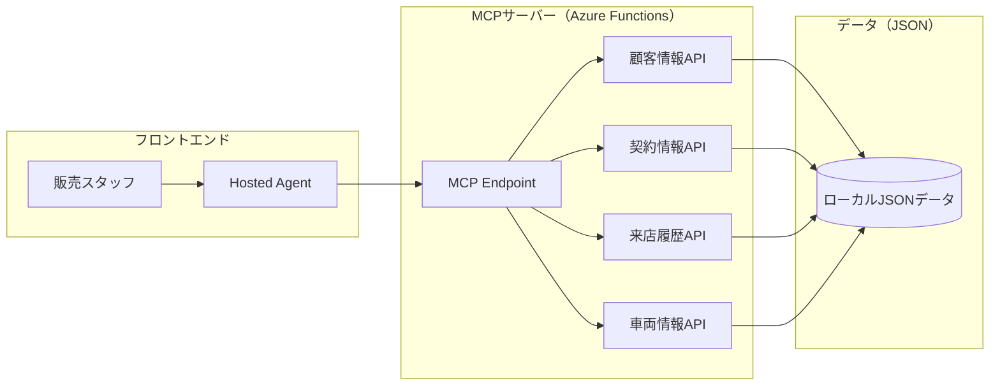
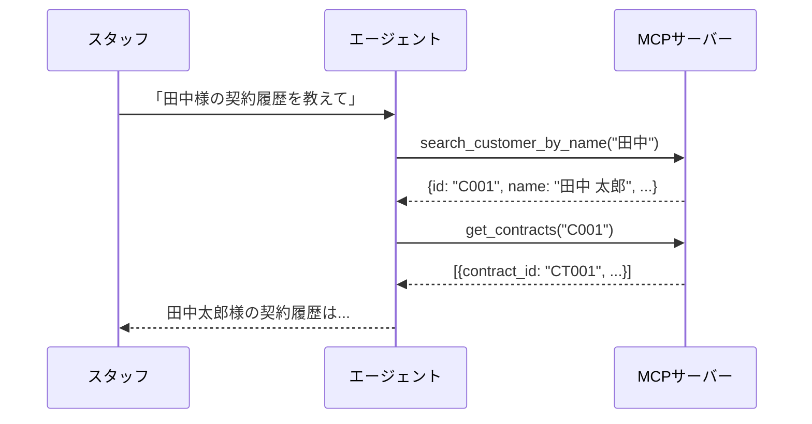
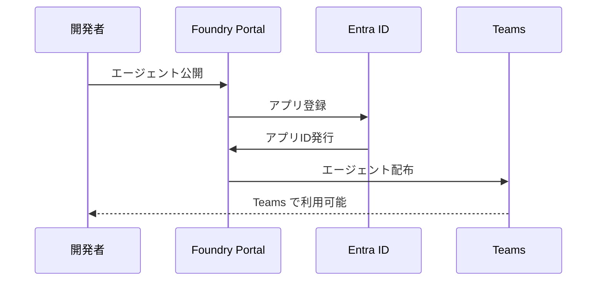

## はじめに

前回の記事「[Microsoft Foundry AIエージェント完全ガイド](https://zenn.dev/nomhiro/articles/microsoft-foundry-agent-poc-20260125)」では、Microsoft Foundry の9つの主要機能を解説しました。その中で「エージェント = プロンプト × ツール」という概念を紹介しましたが、今回はより高度なエージェント開発手法である **Hosted Agent**（Pro-code Agent）に焦点を当てます。

**Hosted Agent とは一言で言うと**
> 自分で書いたコードをコンテナ化し、Microsoft のマネージドインフラ上でエージェントとして実行できる仕組み

本記事では、実際に **販売店スタッフエージェント** を構築しながら、Hosted Agent の技術的な詳細を解説します。

---

## Hosted Agent の基本概念

### プロンプトベースエージェントとの違い

前回紹介したエージェントは「プロンプトベース」でした。GUIでプロンプトを設定し、Foundry が提供するツールを組み合わせる方式です。

| 観点 | プロンプトベース | Hosted Agent |
|------|----------------|--------------|
| 構築方法 | GUIでプロンプト設定 | コードでロジック実装 |
| デプロイ | Foundry内で自動 | コンテナイメージを手動デプロイ |
| 柔軟性 | Foundry提供ツールに限定 | フレームワーク自由選択 |
| ユースケース | シンプルなQ&A | 複雑なワークフロー |
| スケーラビリティ | Foundry管理 | レプリカ数を指定可能 |

### アーキテクチャ

Hosted Agent は以下の流れでデプロイされます



### 対応フレームワーク

Hosted Agent は複数のフレームワークに対応しています

| フレームワーク | Python | C# |
|---------------|--------|-----|
| **Microsoft Agent Framework** | ✅ | ✅ |
| LangGraph | ✅ | ❌ |
| カスタムコード | ✅ | ✅ |

本記事では **Microsoft Agent Framework**（Python）を使用します。

### Hosting Adapter の役割

Hosting Adapter は、エージェントフレームワークと Foundry の間を橋渡しする重要なコンポーネントです

- **プロトコル変換**: Foundry の Request/Response 形式とフレームワークのネイティブ形式を相互変換
- **会話管理**: メッセージのシリアライズ、ストリーミングイベント生成
- **可観測性**: OpenTelemetry によるトレース、メトリクス、ログの出力
- **ローカルテスト**: `localhost:8088` で HTTP サーバーを起動

---

## Hosted Agent の選択基準

### プロンプトベース vs Hosted Agent

| シナリオ | 推奨 |
|---------|------|
| シンプルなQ&Aボット | プロンプトベース |
| 複雑なワークフロー | Hosted Agent |
| 外部API連携多数 | Hosted Agent |
| 迅速なプロトタイプ | プロンプトベース |
| 既存コード再利用 | Hosted Agent |

### フレームワーク選択

| 要件 | 推奨フレームワーク |
|------|-------------------|
| Microsoftエコシステム統合 | Agent Framework |
| 複雑なグラフ構造 | LangGraph |
| 完全カスタム制御 | カスタムコード |

---

## 制限事項と注意点

### プレビュー期間の制限（2026年1月時点）

| 項目 | 制限値 |
|------|--------|
| サブスクリプションあたりリソース数 | 100 |
| リソースあたりHosted Agent数 | 200 |
| 最大 min_replica | 2 |
| 最大 max_replica | 5 |

### 対応リージョン

- 東日本 ✅
- 米国東部 ✅
- 西ヨーロッパ ✅
- 他多数（[公式ドキュメント](https://learn.microsoft.com/en-us/azure/ai-foundry/agents/concepts/hosted-agents?view=foundry)参照）

### 価格

- 2026年2月1日以降に課金開始予定
- プレビュー期間中は無料

---

## 実践シナリオ販売店スタッフエージェント

### シナリオ説明

自動車販売店のスタッフを支援するAIエージェントを構築します。

**想定する業務フロー**
1. スタッフが顧客対応時にエージェントに問い合わせ
2. エージェントが基幹システムから情報を取得して回答
3. スタッフは顧客に即座に正確な情報を提供

### システム構成

バックエンドの基幹システムを **MCPサーバー**（Azure Functions）として実装し、Hosted Agent と連携させます。



### MCPサーバーで提供するツール

| ツール名 | 説明 | 入力パラメータ |
|---------|------|---------------|
| `search_customer_by_name` | 顧客名からIDを検索 | name: str |
| `get_customer_info` | 顧客詳細情報の取得 | customer_id: str |
| `get_contracts` | 契約履歴の取得 | customer_id: str |
| `get_visit_history` | 来店履歴の取得 | customer_id: str |
| `search_vehicles` | 車両在庫の検索 | type: str, color: str (optional) |
| `get_upcoming_services` | サービス予定一覧 | days: int (optional) |

### ツール呼び出しフロー

エージェントは、ユーザーの質問に対して複数のツールを順次呼び出します



**活用シーン例**
- 「田中様の過去の契約履歴を教えて」→ 顧客名検索 → 契約履歴取得
- 「次の車検予定のお客様一覧」→ サービス予定取得
- 「赤いSUVの在庫は？」→ 車両在庫検索
- 「鈴木様の点検履歴」→ 顧客名検索 → 来店履歴取得

---

## ステップバイステップ実装

### Step 1: 前提条件の準備

**必要なリソース**
- Microsoft Foundry プロジェクト
- Azure Container Registry
- Azure Functions（Flex Consumption）
- モデルデプロイメント（gpt-4o推奨）

**RBAC設定**

| 対象リソース | 必要なロール |
|-------------|-------------|
| Foundry アカウント | Azure AI Owner |
| Foundry プロジェクト | Azure AI User |
| Container Registry | AcrPull |


### Step 2: MCPサーバーの構築

まず、基幹システムを模したMCPサーバーを Azure Functions で構築します。

```bash
uv init mcp-server-dealer
cd mcp-server-dealer
uv add azure-functions mcp python-dotenv
```

**MCPツール実装例**

```python
# tools/customer.py
from mcp.server import tool

@tool
def search_customer_by_name(name: str) -> list[dict]:
    """顧客名からIDを検索します（部分一致）

    Args:
        name: 顧客名（例: "田中"）

    Returns:
        マッチした顧客のリスト [{id, name, phone}, ...]
    """
    # customers.json から名前で検索
    ...

@tool
def get_customer_info(customer_id: str) -> dict:
    """顧客IDから詳細情報を取得します

    Args:
        customer_id: 顧客ID（例: "C001"）

    Returns:
        顧客の詳細情報
    """
    ...
```

**Azure Functionsへデプロイ**

```bash
func azure functionapp publish mcp-server-dealer --python
```

### Step 3: Foundry でMCP接続を作成

1. Foundry Portal → Connections
2. 「Add connection」→「MCP Server」
3. MCPサーバーのURL（Azure Functions）を設定


:::message
MCP接続の詳細（認証方式、Project Connection、承認ワークフローなど）については、別記事「[Microsoft Foundry エージェントの MCP 接続を理解する](https://zenn.dev/nomhiro/articles/microsoft-foundry-mcp-connection)」で詳しく解説しています。
:::

### Step 4: Hosted Agent プロジェクト作成

```bash
uv init sales-staff-agent
cd sales-staff-agent
uv add azure-ai-agentserver-agentframework azure-identity python-dotenv
```

### Step 5: エージェントコードの作成

```python
# agent.py - 販売店スタッフエージェント
from agent_framework.azure import AzureAIAgentClient
from azure.ai.projects.models import MCPTool

async def create_agent():
    # MCP接続を使用してツールにアクセス
    mcp_tool = MCPTool(
        server_label="dealer-backend",
        server_url="https://mcp-server-dealer.azurewebsites.net/mcp",
        allowed_tools=[
            "search_customer_by_name",
            "get_customer_info",
            "get_contracts",
            "get_visit_history",
            "search_vehicles"
        ]
    )

    async with AzureAIAgentClient() as client:
        return await client.as_agent(
            name="SalesStaffAgent",
            instructions="""
            あなたは自動車販売店のスタッフアシスタントです。
            基幹システムと連携して、顧客情報、契約履歴、
            来店履歴、車両在庫を検索できます。

            顧客名で問い合わせがあった場合は、まず search_customer_by_name で
            顧客IDを特定してから、詳細情報を取得してください。
            """,
            tools=[mcp_tool]
        )
```

### Step 6: ローカルテスト

```bash
# MCPサーバーをローカルで起動
cd mcp-server-dealer
func start

# 別ターミナルでエージェントを起動
cd sales-staff-agent
uv run python src/container.py
```

REST Client でテスト

```http
POST http://localhost:8088/responses
Content-Type: application/json

{
    "input": {
        "messages": [
            {"role": "user", "content": "田中様の過去の契約履歴を教えて"}
        ]
    }
}
```


### Step 7: コンテナ化とACRプッシュ

```bash
# Docker イメージビルド
docker build -t sales-staff-agent:v1 .

# ACRへプッシュ
az acr login --name myregistry
docker tag sales-staff-agent:v1 myregistry.azurecr.io/sales-staff-agent:v1
docker push myregistry.azurecr.io/sales-staff-agent:v1
```

### Step 8: Hosted Agent の作成

**Azure Developer CLI（推奨）**

```bash
azd ai agent init -m ./agent.yaml
azd up
```

**または Python SDK**

```python
from azure.ai.projects import AIProjectClient
from azure.ai.projects.models import ImageBasedHostedAgentDefinition, MCPTool

agent = client.agents.create_version(
    agent_name="sales-staff-agent",
    definition=ImageBasedHostedAgentDefinition(
        cpu="1",
        memory="2Gi",
        image="myregistry.azurecr.io/sales-staff-agent:v1",
        tools=[
            MCPTool(
                server_label="dealer-backend",
                project_connection_id="mcp-dealer-connection"
            )
        ],
        environment_variables={
            "AZURE_AI_PROJECT_ENDPOINT": "...",
            "MODEL_NAME": "gpt-4o"
        }
    )
)
```


---

## 管理と運用

### ライフサイクル管理

```bash
# 開始
az cognitiveservices agent start \
  --account-name myAccount \
  --project-name myProject \
  --name sales-staff-agent \
  --agent-version 1

# 停止
az cognitiveservices agent stop \
  --account-name myAccount \
  --project-name myProject \
  --name sales-staff-agent \
  --agent-version 1

# 更新（新バージョン作成）
az cognitiveservices agent update \
  --account-name myAccount \
  --project-name myProject \
  --name sales-staff-agent \
  --agent-version 1 \
  --min-replicas 1 \
  --max-replicas 3
```

### 監視とトレース

Hosted Agent は Application Insights と自動統合されます

- OpenTelemetry によるトレース
- リクエスト/レスポンスのログ
- カスタムメトリクス

コンテナログの確認

```bash
curl "https://{endpoint}/api/projects/{project}/agents/{agent}/versions/1/containers/default:logstream?kind=console"
```


---

## チャネルへの公開

### 利用可能なチャネル

| チャネル | 用途 |
|---------|------|
| Web App プレビュー | デモ・テスト |
| Microsoft Teams | 社内コミュニケーション |
| M365 Copilot | エンタープライズ統合 |
| REST API | カスタムアプリ連携 |

### Teams への公開フロー




---

## まとめ

本記事では、Microsoft Foundry の **Hosted Agent** を使って販売店スタッフエージェントを構築しました。

**Hosted Agent の価値**
- インフラ管理不要（コンテナ化・スケーリング自動）
- エンタープライズ統合（Teams、M365 Copilot）
- 好きなフレームワークでコード記述

**学んだこと**
- Hosting Adapter によるプロトコル変換
- MCPサーバーとの連携
- Azure Developer CLI / SDK によるデプロイ

**次のステップ**
- 本番環境へのデプロイ
- 評価・テストの実施
- ガードレールの設定

---

## 参考リソース

### Hosted Agent

- [What are hosted agents?](https://learn.microsoft.com/en-us/azure/ai-foundry/agents/concepts/hosted-agents?view=foundry)
- [Work with Hosted Agents in VS Code](https://learn.microsoft.com/en-us/azure/ai-foundry/agents/how-to/vs-code-agents-workflow-pro-code?view=foundry)
- [Agent Framework Documentation](https://learn.microsoft.com/en-us/agent-framework/)

### MCP接続

- [Microsoft Foundry エージェントの MCP 接続を理解する](https://zenn.dev/nomhiro/articles/microsoft-foundry-mcp-connection) - 本シリーズの別記事
- [MCP Connections Overview](https://learn.microsoft.com/en-us/azure/ai-foundry/agents/how-to/tools/mcp-connection-agents?view=foundry)
- [Azure Functions MCP Extension](https://learn.microsoft.com/en-us/azure/azure-functions/functions-bindings-mcp)

### サンプル

- [Foundry Samples (GitHub)](https://github.com/azure-ai-foundry/foundry-samples)
- [LangGraph Travel Agent Sample](https://github.com/MSFT-Innovation-Hub-India/LangGraph-Foundry-HostedAgent-TravelAgent)
