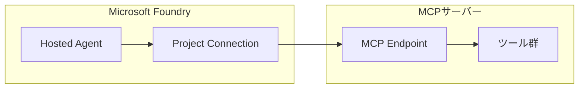
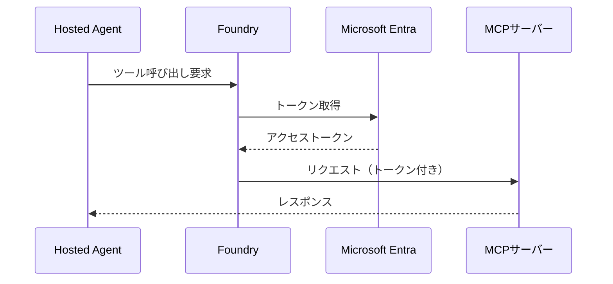
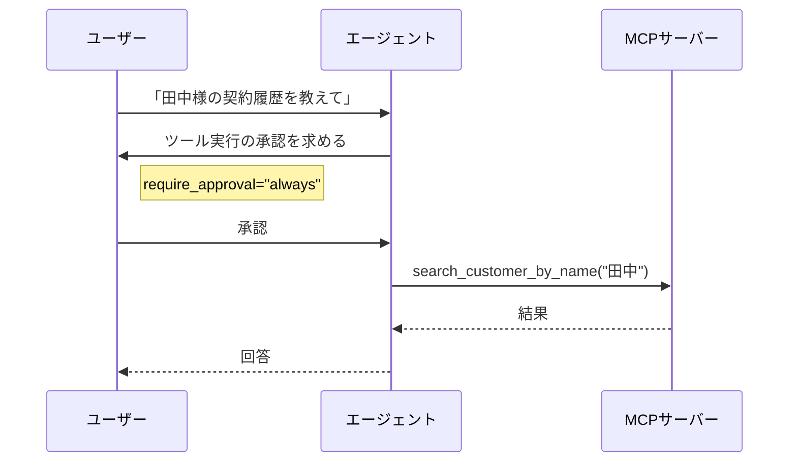

## はじめに

前回の記事「[Microsoft Foundry の Hosted Agent を動かしながら知ろう](https://zenn.dev/nomhiro/articles/microsoft-foundry-hosted-agent)」では、販売店スタッフエージェントを構築しながら Hosted Agent の基本を解説しました。

本記事では、エージェントと外部ツールを連携させる **MCP（Model Context Protocol）接続** について深掘りします。同じ販売店スタッフエージェントのシナリオを使って、MCP接続の設定方法、認証オプション、ベストプラクティスを解説します。

---

## MCP接続とは

MCP（Model Context Protocol）は、エージェントが外部ツールにアクセスするための標準プロトコルです。Foundry では、MCP サーバーへの接続を **Project Connection** として管理できます。



### なぜ MCP 接続が重要か

- **標準化**: 異なるツールを統一的なプロトコルで呼び出し
- **セキュリティ**: 資格情報を Foundry で安全に管理
- **柔軟性**: 複数のエージェントで接続を共有可能

---

## MCP エンドポイントの形式

Foundry では、2つのMCPエンドポイント形式をサポートしています。

| 接続方式 | エンドポイント形式 | 用途 |
|---------|------------------|------|
| Azure Functions MCP 拡張 | `https://<domain>/runtime/webhooks/mcp` | Azure Functions で MCP 拡張機能を使用 |
| セルフホスト MCP | `https://<domain>/mcp` | カスタム MCP サーバー実装 |

### Azure Functions MCP 拡張

Azure Functions の MCP 拡張機能を使用すると、関数アプリを MCP サーバーとして公開できます。

```
https://mcp-server-dealer.azurewebsites.net/runtime/webhooks/mcp
```

**メリット**:
- Azure Functions の Flex Consumption Plan でコスト効率良好
- 認証・スケーリングは Azure が管理
- MCPプロトコルの実装が自動化

### セルフホスト MCP

独自の MCP サーバーを実装する場合のエンドポイント形式です。

```
https://your-custom-server.com/mcp
```

**ユースケース**:
- 既存のバックエンドを MCP 対応させる
- 特殊なプロトコル要件がある場合
- オンプレミス環境での運用

---

## 認証方式

MCP接続では、以下の認証方式が利用可能です。

| 認証方式 | セキュリティ | 推奨度 | ユースケース |
|---------|-------------|-------|-------------|
| **Microsoft Entra + プロジェクトマネージドID** | 最高 | ✅ 本番推奨 | Azure リソース間連携 |
| キーベース認証 | 中 | PoC向け | 開発・テスト環境 |
| OAuth | 高 | サードパーティ連携 | 外部 SaaS 連携 |

### Microsoft Entra + プロジェクトマネージドID（推奨）

**本番環境では Microsoft Entra 認証 + プロジェクトマネージドID を強く推奨します**。



**メリット**:
- APIキーのハードコーディングが不要
- 資格情報は Foundry が安全に管理
- ロールベースのアクセス制御（RBAC）が適用可能
- トークンの自動更新

### キーベース認証

開発・テスト環境での簡易認証として使用できます。

```python
# PoC・開発環境向け
mcp_tool = MCPTool(
    server_label="dealer-backend",
    server_url="https://mcp-server-dealer.azurewebsites.net/runtime/webhooks/mcp",
    api_key="${MCP_API_KEY}"  # 環境変数から取得
)
```

**注意**: 本番環境では使用を避けてください。

---

## Project Connection

### Project Connection とは

Project Connection は、Foundry プロジェクト内で接続情報を安全に管理する仕組みです。

```
┌────────────────────────────────────────────────────────┐
│                  Project Connection                     │
│  ┌────────────────────────────────────────────────┐   │
│  │ • 資格情報を Foundry で安全に保管               │   │
│  │ • 環境変数への APIキー 記述が不要               │   │
│  │ • 複数エージェントで接続を共有可能              │   │
│  │ • 接続情報の一元管理                           │   │
│  │ • 監査ログによる追跡                           │   │
│  └────────────────────────────────────────────────┘   │
└────────────────────────────────────────────────────────┘
```

### 接続の作成（Foundry Portal）

1. Foundry Portal → 「プロジェクト」→「Connections」
2. 「+ New connection」をクリック
3. 「MCP Server」を選択
4. 以下を設定：
   - **接続名**: `mcp-dealer-connection`
   - **サーバーURL**: `https://mcp-server-dealer.azurewebsites.net/runtime/webhooks/mcp`
   - **認証方式**: Microsoft Entra（推奨）または API Key


### 接続の利用（Python SDK）

```python
from azure.ai.projects import AIProjectClient
from azure.ai.projects.models import MCPTool

# Project Connection を使用した MCP ツール設定
mcp_tool = MCPTool(
    server_label="dealer-backend",
    project_connection_id="mcp-dealer-connection",  # 接続名を指定
    allowed_tools=[
        "search_customer_by_name",
        "get_customer_info",
        "get_contracts",
        "get_visit_history",
        "search_vehicles"
    ]
)
```

**ポイント**: `project_connection_id` で接続名を指定することで、資格情報をコードに含めずに MCP サーバーにアクセスできます。

---

## 承認ワークフロー

### require_approval パラメータ

MCPツールの実行前に承認を求めるかどうかを制御できます。

| 設定値 | 動作 | ユースケース |
|-------|------|-------------|
| `never` | 自動実行 | PoC、読み取り専用ツール |
| `always` | 毎回ユーザー承認を要求 | データ変更、重要な操作 |

### 実装例

```python
# PoC・開発環境向け（自動実行）
mcp_tool_dev = MCPTool(
    server_label="dealer-backend",
    project_connection_id="mcp-dealer-connection",
    require_approval="never"
)

# 本番環境向け（承認必須）
mcp_tool_prod = MCPTool(
    server_label="dealer-backend",
    project_connection_id="mcp-dealer-connection",
    require_approval="always",
    allowed_tools=[
        "search_customer_by_name",
        "get_customer_info",
        "get_contracts"
    ]
)
```

### 承認フロー



---

## 販売店スタッフエージェントでの適用

### シナリオ

販売店スタッフエージェントでは、以下の MCP ツールを使用します。

| ツール名 | 操作 | 推奨 require_approval |
|---------|------|----------------------|
| `search_customer_by_name` | 読み取り | `never` |
| `get_customer_info` | 読み取り | `never` |
| `get_contracts` | 読み取り | `never` |
| `get_visit_history` | 読み取り | `never` |
| `search_vehicles` | 読み取り | `never` |
| `update_customer_info` | 書き込み | `always` |

### 完全な設定例

```python
from azure.ai.projects import AIProjectClient
from azure.ai.projects.models import (
    ImageBasedHostedAgentDefinition,
    MCPTool
)
from azure.identity import DefaultAzureCredential

# クライアント初期化
client = AIProjectClient(
    endpoint="https://your-resource.services.ai.azure.com/api/projects/your-project",
    credential=DefaultAzureCredential()
)

# MCP ツール設定（Project Connection 使用）
mcp_tool = MCPTool(
    server_label="dealer-backend",
    project_connection_id="mcp-dealer-connection",
    require_approval="never",
    allowed_tools=[
        "search_customer_by_name",
        "get_customer_info",
        "get_contracts",
        "get_visit_history",
        "search_vehicles"
    ]
)

# Hosted Agent 作成
agent = client.agents.create_version(
    agent_name="sales-staff-agent",
    definition=ImageBasedHostedAgentDefinition(
        cpu="1",
        memory="2Gi",
        image="myregistry.azurecr.io/sales-staff-agent:v1",
        tools=[mcp_tool]
    )
)
```

---

## ベストプラクティス

### 1. 環境ごとに接続を分離

```
mcp-dealer-connection-dev   → 開発環境
mcp-dealer-connection-stg   → ステージング環境
mcp-dealer-connection-prod  → 本番環境
```

### 2. 最小権限の原則

`allowed_tools` で必要なツールのみを許可：

```python
mcp_tool = MCPTool(
    server_label="dealer-backend",
    project_connection_id="mcp-dealer-connection",
    allowed_tools=["search_customer_by_name", "get_customer_info"]  # 必要最小限
)
```

### 3. 本番環境では Microsoft Entra 認証

キーベース認証は開発・テストのみに限定し、本番では必ず Microsoft Entra 認証を使用してください。

### 4. 監査ログの活用

Foundry の監査ログで MCP 接続の利用状況を追跡できます。

---

## トラブルシューティング

### 接続エラー

| エラー | 原因 | 対処 |
|-------|------|------|
| `Connection refused` | MCPサーバーが起動していない | サーバーの状態を確認 |
| `401 Unauthorized` | 認証失敗 | 資格情報・RBAC設定を確認 |
| `404 Not Found` | エンドポイントが間違っている | URL形式を確認 |
| `Tool not found` | allowed_tools に含まれていない | ツール名を確認 |

### デバッグ手順

1. **MCPサーバーの疎通確認**
   ```bash
   curl https://mcp-server-dealer.azurewebsites.net/runtime/webhooks/mcp/health
   ```

2. **Foundry 接続のテスト**
   - Foundry Portal → Connections → 接続を選択 → 「Test connection」

3. **ログの確認**
   - Application Insights でトレースを確認
   - MCPサーバーのログを確認

---

## まとめ

本記事では、Microsoft Foundry エージェントの MCP 接続について解説しました。

**ポイント**:
- **Project Connection** で資格情報を安全に管理
- **Microsoft Entra 認証** を本番環境で使用
- **require_approval** で承認ワークフローを制御
- **allowed_tools** で最小権限の原則を適用

MCP 接続を適切に設定することで、セキュアで管理しやすいエージェントシステムを構築できます。

---

## 参考リソース

- [MCP Connections Overview](https://learn.microsoft.com/en-us/azure/ai-foundry/agents/how-to/tools/mcp-connection-agents?view=foundry)
- [Azure Functions MCP Extension](https://learn.microsoft.com/en-us/azure/azure-functions/functions-bindings-mcp)
- [What are hosted agents?](https://learn.microsoft.com/en-us/azure/ai-foundry/agents/concepts/hosted-agents?view=foundry)
- [Agent Framework Documentation](https://learn.microsoft.com/en-us/agent-framework/)
